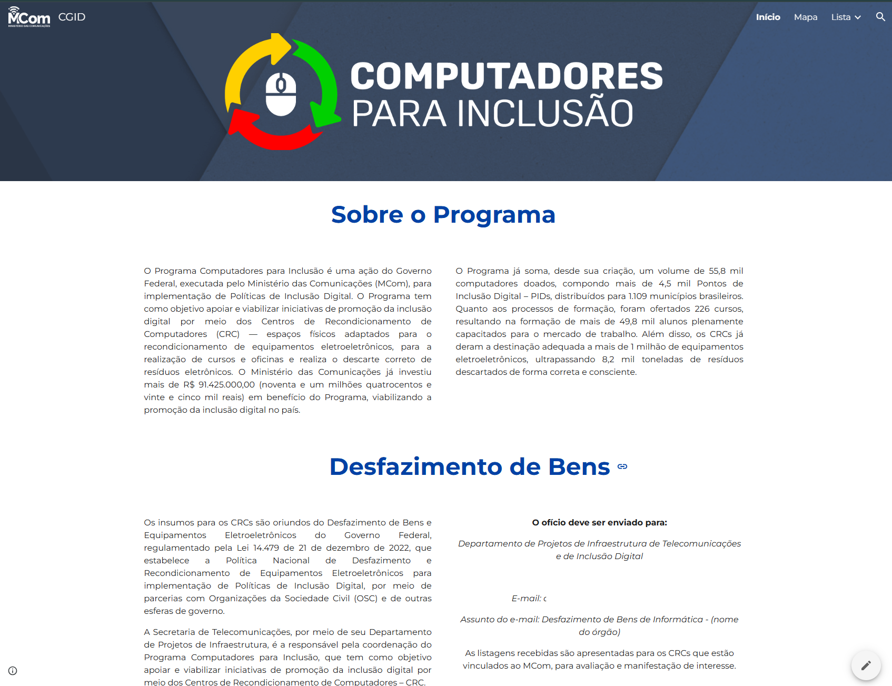
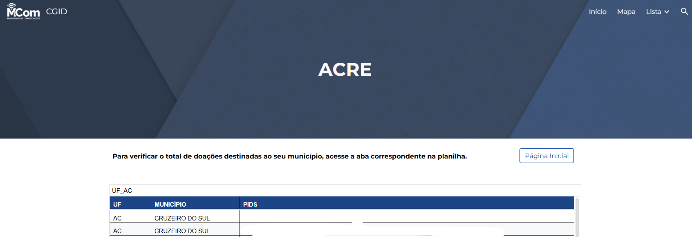

# Google Sites - Apresentação de Dados


## Sobre o Projeto

Sistema desenvolvido utilizando Google Sites e Google Sheets para apresentação visual e consulta de dados do Programa Computadores para Inclusão durante eventos institucionais. A solução permitia que gestores públicos e representantes municipais acessassem informações sobre entregas de equipamentos, formações realizadas e demais indicadores do programa de forma rápida, intuitiva e organizada.

---

## Screenshots

### Visão geral do site


### Exemplo de consulta de dados


---

## Funcionalidades

- Apresentação visual de indicadores do programa
- Consulta de entregas realizadas por estado
- Exibição de formações e capacitações executadas
- Integração com planilhas Google Sheets
- Interface amigável para eventos institucionais
- Facilidade de acesso às informações em tempo real

---

## Tecnologias Utilizadas

| Tecnologia | Descrição |
|------------|-----------|
| Google Sites | Construção e publicação do portal |
| Google Sheets | Armazenamento e atualização dos dados |

---

## Estrutura do Projeto

- google-sites-dashboard/
- |
- |--- docs/ # Prints de demonstração
- |--- README.md

---

## Como Executar

1. Clone o repositório:
   ```bash
   git clone https://github.com/ProfissionalJV/google-sites-presentation.git
   ```

2. Acesse o Google Sites utilizado como modelo

3. Conecte as planilhas Google Sheets desejadas

4. Publique o site para disponibilização das informações

---

## Observação

O site original contém informações institucionais e dados de uso interno. Algumas informações e elementos visuais foram ocultados ou adaptados exclusivamente para fins de documentação, demonstração pública e composição de portfólio.

---

## Autor

**Victor Arsego Lêla**

- Desenvolvedor Web e Automatizador de Processos
- Engenharia da Computação - CEUB
- Gestão Pública - Estácio
- [LinkedIn](https://www.linkedin.com/in/vltech/)
